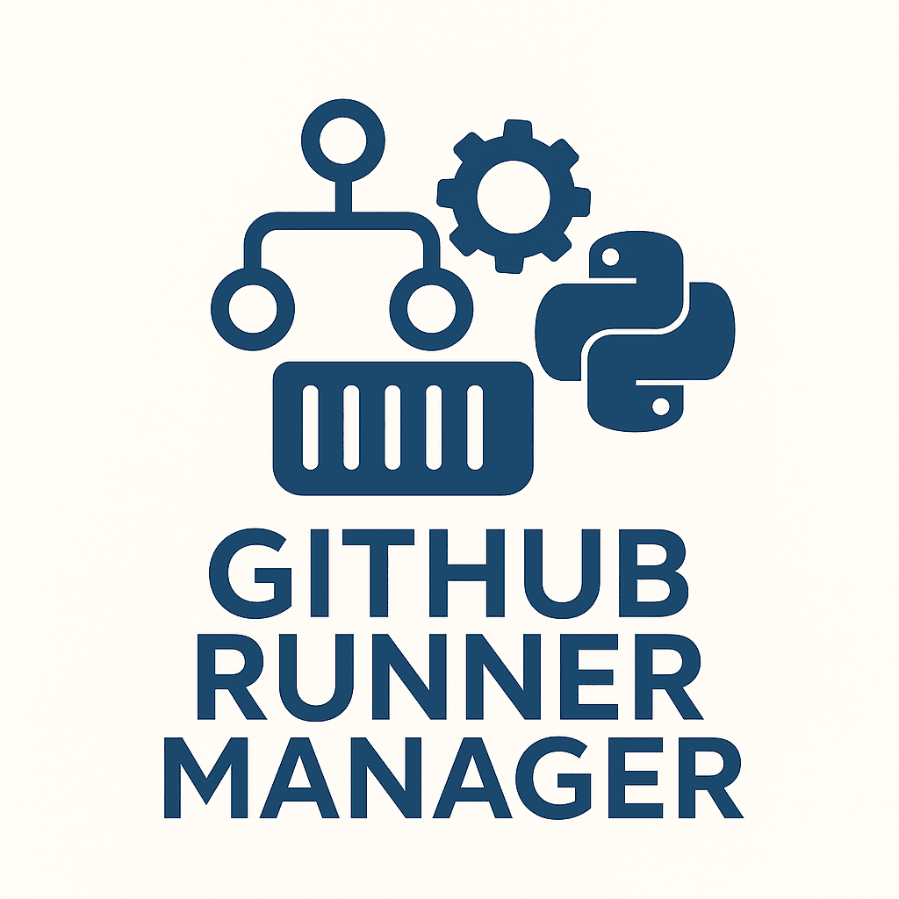
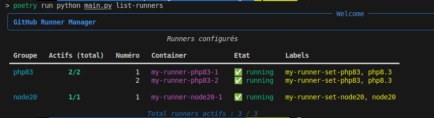

# Github Runner Manager



[](https://github.com/glefer/github-runner-manager/actions/workflows/main.yml)
[](https://codecov.io/gh/glefer/github-runner-manager)

[](https://hub.docker.com/r/glefer/github-runner-manager)


Une application Python permettant de gérer facilement vos runners github depuis n'importe quel serveur ou en local.



## Installation

Prérequis :

- Python 3.11+ (3.13 recommandé)
- Docker (le démon doit être accessible si vous utilisez les runners locaux)
- Poetry (gestionnaire de dépendances)

Installation locale :

1. Cloner le dépôt
2. Installer les dépendances :

     poetry install

3. (Optionnel) Construire l'image Docker si vous souhaitez exécuter l'application en conteneur :

     docker build -t github-runner-manager -f Dockerfile .

## Configuration (.env et runners_config.yaml)

Le comportement de l'application est principalement contrôlé par deux sources :

- Un fichier `runners_config.yaml` (présent à la racine) qui décrit les runners,
    images de base, labels et paramètres spécifiques à chaque runner.
- Des variables d'environnement (optionnel) pour les secrets, les endpoints,
    et les paramètres d'exécution (ex : DOCKER_HOST, GITHUB_TOKEN).

Bonne pratique : ne stockez jamais de secrets en clair dans `runners_config.yaml`.
Préférez :

- Variables d'environnement (exporter localement ou via un gestionnaire de secrets).
- Fichiers `.env` non committés (ajoutez-les à `.gitignore`).

Exemple minimal `.env` :
```dotenv
GITHUB_TOKEN=ghp_................................
DOCKER_HOST=unix:///var/run/docker.sock
```
Le fichier `runners_config.yaml` contient une clé racine `runners` avec une liste
de définitions. Chaque définition inclut au minimum `name` et `image`.

Exemple simplifié (runners_config.yaml) :

```yaml
runners:
    - name: runner-1
        image: ghcr.io/actions/runner:latest
        labels: [linux, docker]
        env:
            MY_VAR: value
```

Le projet inclut un schéma de configuration (`src/services/config_schema.py`) qui
valide et normalise la configuration via Pydantic. Les tests utilisent ce schéma
pour s'assurer que les configurations d'exemple restent valides.

## Utilisation Docker

Pour exécuter des runners locaux, l'application communique avec le démon Docker.
En local, montez le socket Docker dans le conteneur pour permettre la gestion des
conteneurs :

```text
--volume /var/run/docker.sock:/var/run/docker.sock
```

Dans la plupart des cas, exécuter l'application localement suffit :

poetry run python main.py <commande>

ou utiliser l'image Docker construite précédemment :

docker run --rm -v /var/run/docker.sock:/var/run/docker.sock github-runner-manager <commande>

## Commandes CLI

L'outil expose une interface en ligne de commande (Typer) documentée via l'aide :

poetry run python main.py --help

Commandes courantes :

- list-runners            : lister les runners définis
- start-runners           : démarrer des runners
- stop-runners            : arrêter des runners
- remove-runners          : supprimer des runners (optionnel : en conservant les conteneurs)
- check-base-image-update : vérifier si les images de base ont des mises à jour disponibles

## Développement et tests

Le projet utilise `pytest` pour les tests unitaires. Les fixtures ont été
centralisées pour réduire la duplication et améliorer l'isolation des tests.

Exécuter la suite de tests :

poetry run pytest -q


## Sécurité et bonnes pratiques

- Ne commitez jamais de secrets (`GITHUB_TOKEN`, credentials Docker) dans le
    dépôt.
- Utilisez des variables d'environnement, des `.env` locaux (ignorés par Git), ou
    un gestionnaire de secrets (Vault, AWS Secrets Manager, etc.).
- Attention aux images de runners publiques — préférez des images officielles ou
    construites et auditées par vos équipes.

## Contribution

Les contributions sont bienvenues. Ouvrez une pull request avec des changements
clairs et des tests associés. Respectez le style du projet et ajoutez des tests
pour toute logique métier critique.

## Licence

MIT


## Utilisation dans un container Docker

Un `Dockerfile` est fourni afin de pouvoir construire votre propre image si vous avez des besoins plus spécifiques.

### Exemple de build et run


```bash
# Build de l'image
docker build -t github-runner-manager .

# Lancement avec accès au Docker de l'hôte et aux Dockerfile custom
docker run --rm -it \
    -v /var/run/docker.sock:/var/run/docker.sock \
    -v $(pwd)/runners_config.yaml:/app/runners_config.yaml \
    -v $(pwd)/config:/app/config:ro \
    github-runner-manager list-runners

> ℹ️ Depuis la version docker-py, le binaire `docker` n'est plus requis dans le container. Seul le montage du socket `/var/run/docker.sock` est nécessaire pour piloter Docker via l'API Python.
```

> ⚠️ Le montage du dossier `./config` est nécessaire pour les builds d'image runners personnalisés (Dockerfile custom).

Vous pouvez remplacer `list-runners` par n'importe quelle commande CLI du projet.

**Attention :**
- Le montage du socket Docker donne un accès complet à Docker sur l'hôte. À utiliser uniquement dans un contexte de confiance.
## Authentification et configuration du token

Depuis septembre 2025, la gestion des runners GitHub utilise un token personnel GitHub (scopes : `admin:org`, `repo`) pour générer dynamiquement un registration token à chaque création ou suppression de runner.

**Exemple de configuration dans `runners_config.yaml` :**

```yaml
runners_defaults:
    base_image: ghcr.io/actions/actions-runner:2.328.0  # Image de base commune
    org_url: https://github.com/it-room
    github_personal_token: <VOTRE_TOKEN_PERSONNEL_GITHUB>  # scopes: admin:org, repo
```

Le registration token n'est plus stocké en dur : il est généré à la volée via l'API GitHub et injecté dans la variable d'environnement `RUNNER_TOKEN` du container. Cette variable est utilisée pour l'enregistrement et la suppression du runner (`config.sh remove`).

**Sécurité :**
- Ne partagez jamais votre token personnel.
- Privilégiez un token restreint à l'organisation ou au repo cible.

# GitHub Runner Manager

CLI de gestion des runners GitHub Actions avec Docker. Ce projet utilise une architecture en services simplifiée et adaptée à ses besoins.

## Architecture

Architecture simplifiée orientée services :

```
               +--------------------+
               |   Presentation     |
               |  (CLI Typer)       |
               +----------+---------+
                          |
                          v
               +-----------------------+
               |       Services        |
               |                       |
               | +-------------------+ |
               | |  DockerService    | |
               | +-------------------+ |
               |          |            |
               | +-------------------+ |
               | |  ConfigService    | |
               | +-------------------+ |
               +-----------------------+
```


## 🚀 Démarrage

### Prérequis

* Python 3.13+
* Poetry

### Installation

1. Cloner :
```bash
git clone https://github.com/glefer/github-runner-manager
cd github-runner-manager
cp runners_config.yaml.dist runners_config.yaml
```
2. Installer :
```bash
poetry install
```
3. Aide :
```bash
poetry run python main.py --help
```

## 📋 Commandes

```
python main.py build-runners-images    # Construire les images Docker
python main.py start-runners           # Démarrer les runners Docker
python main.py stop-runners            # Arrêter les runners Docker
python main.py remove-runners          # Supprimer les runners Docker
python main.py check-base-image-update # Vérifier les mises à jour d'images
python main.py list-runners            # Lister les runners Docker
```

### Utilisation avec Make

```bash
make help              # Afficher l'aide
make install           # Installer les dépendances
make build-images      # Construire les images
make start-runners     # Démarrer les runners
make list-runners      # Lister les runners
```

### Exemples avec Poetry

```bash
poetry run python main.py build-runners-images
poetry run python main.py list-runners
```

## 🧪 Development

### Tests
```bash
poetry run pytest
```

### Qualité
```bash
poetry run black src tests
poetry run isort src tests
poetry run mypy src
```

### Pre-commit
```bash
poetry run pre-commit install
```

## 🛠️ Stack
Python 3.13, Poetry, Typer, Rich, pytest, Black, isort, mypy, Docker, YAML.

## 📝 Contribution
1. Respecter la séparation des responsabilités entre services
2. Ajouter des tests pour toute nouvelle fonctionnalité
3. Documenter les APIs des services modifiés/ajoutés
4. Assurer une bonne gestion des erreurs et des cas limites

## 📄 Licence
This project is licensed under the MIT license — see the LICENSE file.
